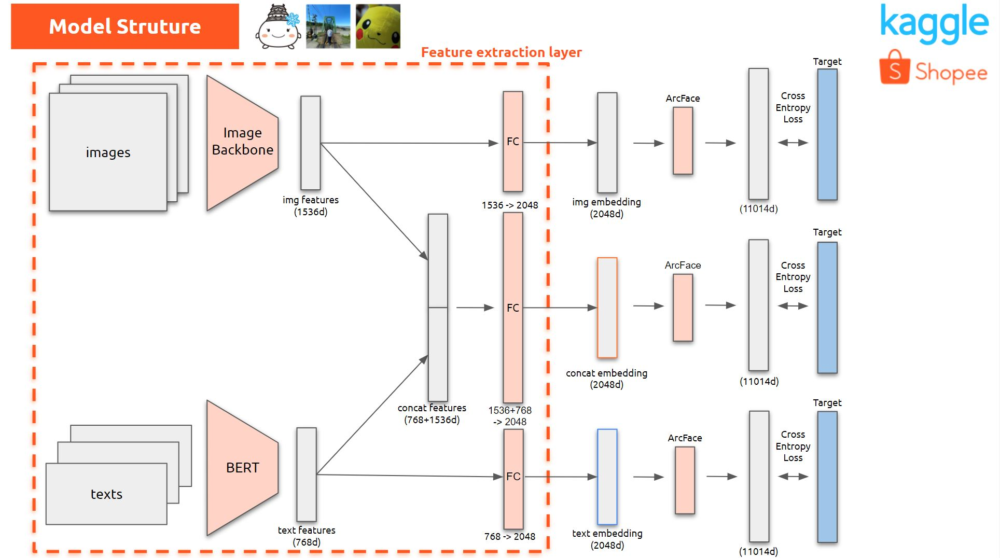

# kaggle-shopee-6th-place-solution

- 6th place solution for the [Kaggle Shopee - Price Match Guarantee](https://www.kaggle.com/c/shopee-product-matching/overview) competition. (kiccho's part)
- Discussion: https://www.kaggle.com/c/shopee-product-matching/discussion/238010

## Summary

### Model



### Ensemble


## Setup & Reproduce the results

### Install packages

```sh
pipenv install --skip-lock --dev
```

### Download the dataset

- Download the dataset from the [competition page](https://www.kaggle.com/c/shopee-product-matching/data) and place it in the `./input` directory

### Run train.py

```sh
python src/kaggle_shopee/bin/train.py --env local --exp exp470
python src/kaggle_shopee/bin/train.py --env local --exp exp471
```
